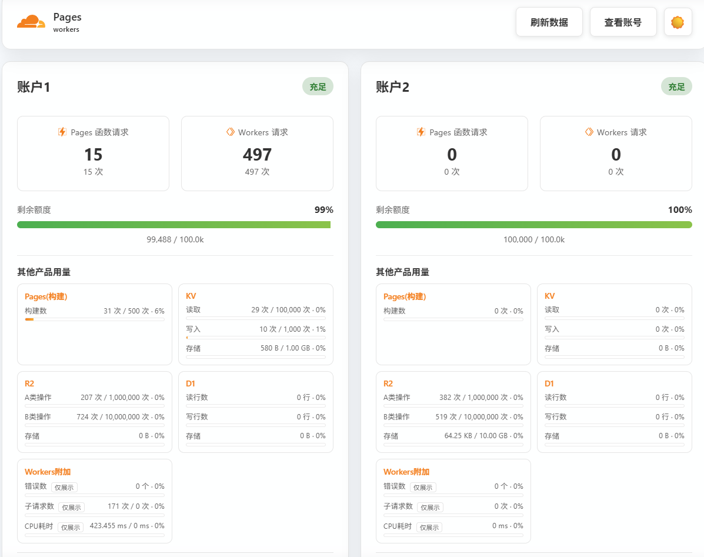

[]()
[](https://opensource.org/licenses/MIT)

Cloudflare Workers/Pages 用量监控

一个基于 Cloudflare Workers 开发的用量监控工具，可以实时监控多个 Cloudflare 账户的 Workers 和 Pages 服务请求使用情况。




## ✨ 功能特点

**·** 🎯 多账户支持 - 同时监控多个 Cloudflare 账户

**·** 📊 实时数据 - 显示 Workers 和 Pages 的请求量和使用情况

**·** 🎨 美观界面 - 现代化、响应式的仪表板界面

**·** 🌙 主题切换 - 支持亮色/暗色主题

**·** ⚡ 快速响应 - 使用并发查询优化性能

**·** 🔄 自动刷新 - 每 60 秒自动更新数据（服务端另有 60 秒缓存，降低 API 调用）

**·** 📱 移动友好 - 完美适配各种屏幕尺寸


## ✨ 本分支定制功能

在原有监控仪表盘基础上，本分支新增了**多产品免费用量监控与阈值自动通知**：

**·**  多产品监控 - 除 Workers/Pages 请求量外，还监控 **KV、R2、D1、Pages构建** 的核心免费用量指标（读取/写入、存储、R2 按 A类/B类操作分别统计、D1 读写行数、Pages 每月构建数等）

**·**  阈值通知 - 各计费指标用量达到合理默认阈值时自动提醒（如日额 50% / 80% / 95%、月额 80% / 95%）；也可用 `THRESHOLD_<产品>_<指标>` 自定义绝对阈值

**·**  非计费指标只展示 - `errors`、`subrequests`、CPU耗时 等不产生账单的指标仅在仪表盘展示、标记"仅展示"，**不触发告警**，避免误报

**·** 👥 按账户独立监控 - 每个账户单独判断、各自触发通知

**·** 📆 按产品周期去重 - Workers/KV/D1 按**日**（免费额度按 UTC 零点重置）、R2/Pages 按**月**（免费额度按月），同一阈值一个周期只提醒一次，不重复打扰

**·** 💬 多渠道推送 - 同时支持 Server酱(微信) 与 Telegram Bot，可分别开关

**·** ⏰ 自动执行 - 采用独立的 Cloudflare Worker + Cron 定时任务，无需打开页面也会自动检查并推送（Pages 不支持定时任务）

**·** 💰 省额度设计 - 低于最低阈值时不读取 KV、仅在跨越新阈值时才写入，尽量压低免费 KV 读写次数

> 实现说明：监控逻辑在 `monitor/`（独立 Worker），仪表盘仍在 `public/` + `functions/`（Pages），两者共用同一份 `EDGE` 账户配置。监控产品列表由 `MONITOR_PRODUCTS` 控制，默认 `workers,kv,r2,d1,pages`。监控 Workers 的 `errors/subrequests/cpuTimeMs` 为只读展示项。

**各计费指标的合理默认阈值**（可用 `THRESHOLD_<产品>_<指标>` 覆盖）：

| 指标 | 免费额度 | 周期 | 默认告警阈值 |
|--|--|--|--|
| Workers 请求 | 10万/天 | 日 | 5万 / 8万 / 9.5万 |
| KV 读 | 10万/天 | 日 | 5万 / 8万 / 9.5万 |
| KV 写 | 1千/天 | 日 | 800 / 950 |
| KV 存储 | 1GB | 日 | 80% / 95% |
| R2 A类操作 | 100万/月 | 月 | 80万 / 95万 |
| R2 B类操作 | 1000万/月 | 月 | 800万 / 950万 |
| R2 存储 | 10GB | 月 | 80% / 95% |
| D1 读行 | 500万/天 | 日 | 400万 / 475万 |
| D1 写行 | 10万/天 | 日 | 8万 / 9.5万 |
| D1 存储 | 5GB | 日 | 80% / 95% |
| Pages 构建 | 500/月 | 月 | 250 / 400 / 475 |


## 🚀 快速开始

**前提条件**

**1** Cloudflare 账户ID


**2** Cloudflare账户API密钥


**部署步骤**

**1.** 克隆或下载项目
   ```bash
   git clone <repository-url>
   cd workers-usage-monitor
   ```
**2.** 配置与环境变量

   Pages 部署二选一：
   - **控制台（Git 集成）**：构建输出目录为 `public`，并在 Pages 控制台设置 `EDGE` 环境变量。
   - **命令行（wrangler）**：`pnpm deploy:pages`（首次会引导创建项目）。


   在 Cloudflare Pages 控制台中设置 EDGE 环境变量，格式如下：
   ```json
   [
 {
    "name": "这里名称随意,例如:账户1",
    "token": "Cloudflare账户API密钥",
    "accountId": "Cloudflare 账户ID",
    "total": 100000
  },
  {
    "name": "这里名称随意,例如:账户2",
    "token": "Cloudflare账户API密钥",
    "accountId": "Cloudflare 账户ID",
    "total": 100000
  }
   多帐号以此类推……
   ]
   ```
**4.** 访问监控面板
   打开 Pages 的 URL 即可访问监控面板。

## ⚙️ 配置说明

环境变量
| 变量名 | 类型 | 必须 | 说明 |
|--|--|--|--|
|EDGE|密钥|是|账户数组，格式见下方（Pages 仪表盘与监控 Worker 各配一份）|
|MONITOR_PRODUCTS|文本|否|启用监控的产品，逗号分隔，默认 `workers,kv,r2,d1,pages`|
|THRESHOLDS|文本|否|兼容旧版：仅对 workers/requests 生效，阈值列表（逗号分隔），默认 `100000,50000,20000,10000`|
|THRESHOLD_\<PRODUCT\>_\<METRIC\>|文本|否|自定义某产品某指标阈值（逗号分隔升序绝对数值），如 `THRESHOLD_KV_WRITES="800,900,1000"`；设 `0` 表示不监控该指标|
|SERVERCHAN_KEY|密钥|否|Server酱(微信) SendKey，配置后启用微信推送|
|TG_BOT_TOKEN|密钥|否|Telegram 机器人 Token，配置后启用 TG 推送|
|TG_CHAT_ID|文本|否|Telegram 接收人 chat id（与 TG_BOT_TOKEN 一起配置）|

> 说明：`EDGE`、`MONITOR_PRODUCTS`、`THRESHOLDS`、`THRESHOLD_*`、通知令牌为**监控 Worker** 的配置；`EDGE` 同时也是 **Pages 仪表盘**的配置。KV 命名空间绑定名为 `KV_STATE`，仅在监控 Worker 上绑定。

### 参数详解

**EDGE**（账户数组 JSON，两类部署共用同一格式）

| 字段 | 说明 |
|--|--|
| `name` | 账户显示名（随意，如"账户1"） |
| `token` | Cloudflare API Token（需 `Account Analytics: Read` 权限） |
| `accountId` | Cloudflare 账户 ID |
| `total` | 配额基准值（默认 `100000`，与请求数合计比较，仅用于仪表盘进度条；各产品真实免费额度在代码注册表中） |

**wrangler.toml（monitor/）参数**

| 参数 | 说明 |
|--|--|
| `name` / `main` | Worker 名称与入口（`worker.js`） |
| `compatibility_date` | Workers 运行时兼容日期 |
| `kv_namespaces` | KV 绑定；`binding = "KV_STATE"`，`id` 填控制台创建的命名空间 ID（本地 dev 可先用占位符，仅 deploy 需要真实 ID） |
| `triggers.crons` | 定时触发表达式，默认 `0 * * * *`（每小时整点） |

**监控指标与阈值**

- 监控产品由 `MONITOR_PRODUCTS` 控制（默认 `workers,kv,r2,d1,pages`）；产品/指标/免费额度注册表在 `monitor/worker.js` 的 `FREE` 与 `functions/api.js` 的 `PRODUCT_DEFS`。
- 各指标默认阈值按产品配置（见上文"合理默认阈值"表）；用 `THRESHOLD_<PRODUCT>_<METRIC>` 覆盖为绝对数值（逗号分隔升序），设 `0` 即不监控该指标。
- 周期：Workers/KV/D1 按**日**（`YYYY-MM-DD`）去重，R2/Pages 按**月**（`YYYY-MM`）去重。

**API 密钥权限**

确保 API 密钥具有以下权限：

**·** Account Analytics: Read

**·** Pages: Read（如需统计 Pages 项目/构建数；缺失时该项目显示为不可用/0，不阻塞其他监控）

## 🚧 部署教程（阈值监控 Worker）

监控 Worker 用来**定时**检查每日用量并推送通知（Pages 不支持定时任务，故用 Worker）。

**1.** 创建 KV 命名空间
1. 进入 Cloudflare 控制台 → Workers & Pages → KV。
2. 新建命名空间，例如命名为 `cf-monitor-state`，复制它的 **namespace id**。

**2.** 填写 `monitor/wrangler.toml`
1. 复制模板 `monitor/wrangler.toml.example` 为 `monitor/wrangler.toml`（真实配置文件已被 `.gitignore` 忽略，不会提交到仓库）。
2. 打开 `monitor/wrangler.toml`，把上一步的 KV 命名空间 ID 填入 `kv_namespaces` 中的 `id` 字段。
3. 如需调整监控范围或阈值，可取消注释 `MONITOR_PRODUCTS`（默认 `workers,kv,r2,d1,pages`）、`THRESHOLDS` 或 `THRESHOLD_<产品>_<指标>`（vars）以及 `crons`。

**3.** 配置敏感变量（项目根目录执行，每次输入一个变量名）
```
pnpm secret:put EDGE            # 必需的账户数组，格式同前面的 EDGE
pnpm secret:put SERVERCHAN_KEY  # 可选，Server酱 SendKey
pnpm secret:put TG_BOT_TOKEN    # 可选，Telegram Bot Token
pnpm secret:put TG_CHAT_ID      # 可选，Telegram 接收 chat id
```

`EDGE` 内容示例（与 Pages 仪表盘同款，多账户以此类推）：
```json
[
  { "name": "账户1", "token": "Cloudflare账户API密钥", "accountId": "Cloudflare账户ID", "total": 100000 }
]
```

**4.** 部署 Worker（项目根目录执行）
```
pnpm deploy:monitor
```

**5.** 验证
1. 打开 Worker 访问地址，返回 `{"ok": true, ...}` 即运行正常。
2. 临时把 `THRESHOLDS` 调小（如 `"1,50"`）并触发一次 Cron，观察是否收到 Server酱/Telegram 消息；同一阈值一天内不会重复推送。

> 提示：仪表盘（Pages）与监控（Worker）都需要各自配置 `EDGE`；仅在 Worker 上绑定 `KV_STATE`。

## 🧪 本地开发测试

依赖 wrangler CLI（已配置于 `package.json`），首次运行：

```bash
pnpm install
```

**敏感变量**：复制模板为真实配置文件并填入密钥（已被 `.gitignore` 忽略，不会提交）：
- 根目录 `.dev.vars` ← 仪表盘用（仅 `EDGE`）
- `monitor/.dev.vars` ← 监控 Worker 用（`EDGE` + 通知令牌）

`.dev.vars` 格式（KEY=VALUE，注释用 `#`）：
```
EDGE=[{"name":"账户1","token":"你的API Token","accountId":"你的账户ID","total":100000}]
SERVERCHAN_KEY=你的SendKey
TG_BOT_TOKEN=你的BotToken
TG_CHAT_ID=你的ChatId
```

非敏感参数（`MONITOR_PRODUCTS`、`THRESHOLDS`、`THRESHOLD_*`）配在 `monitor/wrangler.toml` 的 `[vars]` 或注释示例中，无需放入 `.dev.vars`。

**启动命令**（见 `package.json` scripts）：

| 命令 | 作用 | 访问地址 |
|--|--|--|
| `pnpm dev:pages` | 本地运行仪表盘（加载 `functions/`） | http://localhost:8788 |
| `pnpm dev:monitor` | 本地运行监控 Worker（KV 用本地模拟） | http://localhost:8787 |

监控 Worker 的 Cron 不会自动触发，需手动触发一次监控流程：

```
http://localhost:8787/__scheduled?cron=0+*+*+*+*
```

本地验证时建议把阈值临时调小（如 `THRESHOLD_D1_ROWSREAD="1,50"`），即可观察推送与 KV 去重行为。

## 🎯 使用方法

**基本操作**

**1.** 查看总览：首页显示所有账户的总览统计

**2.** 切换账户：点击"查看账号"下拉菜单选择特定账户

**3.** 刷新数据：点击"刷新数据"按钮手动更新

**4.** 主题切换：点击主题切换按钮切换亮色/暗色模式

## 📊 数据说明

监控指标

**·** Pages 请求数：Cloudflare Pages 函数的调用次数

**·** Workers 请求数：Cloudflare Workers 的调用次数

**·** 剩余额度：总配额减去已使用量

**·** 使用百分比：剩余额度占总配额的百分比

**多产品用量**（每账户卡片内"其他产品用量"区块，监控 Worker 亦按此告警）

| 产品 | 指标 | 免费额度（默认） | 周期 |
|--|--|--|--|
| Workers | 请求数（errors/子请求/CPU耗时 仅展示不告警） | 10万/天 | 日 |
| KV | 读取 / 写入 / 存储 | 读10万、写1千/天，存储1GB | 日 |
| R2 | A类操作 / B类操作 / 存储 | A类100万、B类1000万/月，存储10GB | 月 |
| D1 | 读行数 / 写行数 / 存储 | 读500万行、写10万行/天，存储5GB | 日 |
| Pages | 构建数 | 500/月 | 月 |

> 免费额度以 Cloudflare 官方最新为准，可在 `monitor/worker.js` 的 `FREE` 注册表与 `functions/api.js` 的 `PRODUCT_DEFS` 中调整。各指标默认阈值按产品配置（见上文"合理默认阈值"表）。

**状态指示**

**·** 🟢 充足：剩余额度 ≥ 70%

**·** 🟡 警告：剩余额度 30% - 70%

**·** 🔴 不足：剩余额度 < 30%

## 🔧 技术细节

**架构设计**

```
用户请求 → Cloudflare Worker → Cloudflare GraphQL API → 数据处理 → 响应返回
```

**性能优化**

**·** 并发查询：同时查询多个账户，大幅减少等待时间

**·** 智能缓存：60 秒缓存机制，减少 API 调用

**·** 重试机制：自动重试失败的请求

**·** 错误隔离：单个账户失败不影响其他账户

## 技术栈

**·** 运行时：Cloudflare Pages

**·** 前端：原生 HTML/CSS/JavaScript

**·** API：Cloudflare GraphQL API

**·** 部署：Cloudflare 边缘网络

自定义配置

修改代码中的常量来调整行为：

```javascript
// 调整并发限制
const CONCURRENT_LIMIT = 5;

// 调整缓存时间
const ttl = 2 * 60 * 1000; // 2分钟

// 调整重试策略
const maxRetries = 2;
const retryDelay = 1000;
```

## ⚠️ 注意事项

**1.** API 限制：Cloudflare API 有速率限制，请合理配置刷新频率

**2.** 权限安全：妥善保管 API 密钥，使用最小权限原

**3.** 数据延迟：监控数据可能有几分钟的延迟

**4.** 配额计算：确保配置的总配额与实际账户配额一致

## 📄 许可证

本项目基于 MIT 许可证开源 - 查看 LICENSE 文件了解详情。

## 🙏 致谢

**·** Cloudflare Workers
**·** Cloudflare GraphQL API
**·** 所有贡献者和用户

---

有问题？ 请提交 Issue 或联系维护者。

觉得有用？ 请给个 ⭐️ 支持一下！
